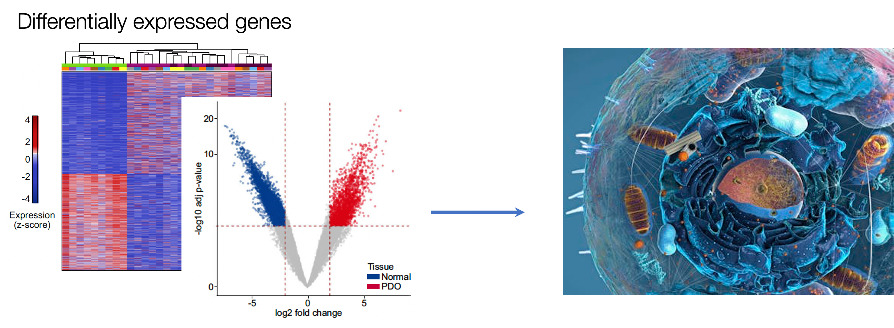
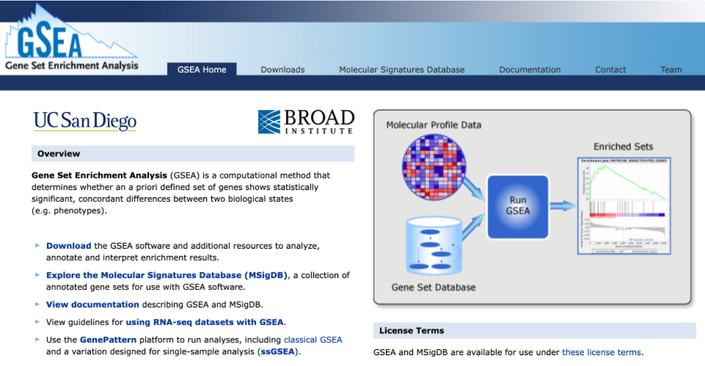
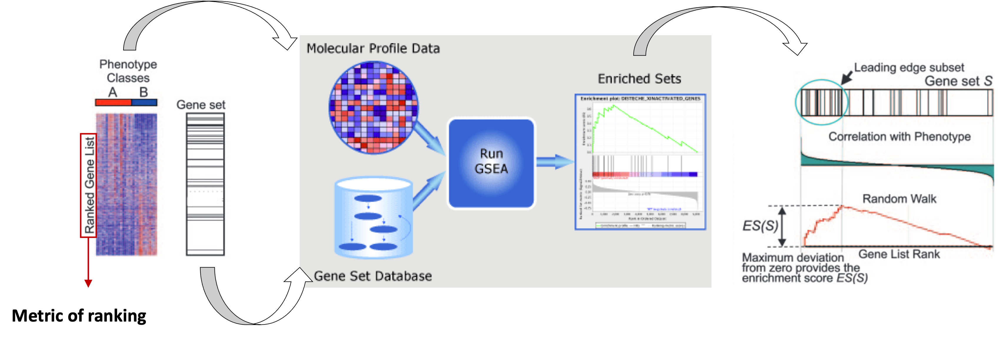
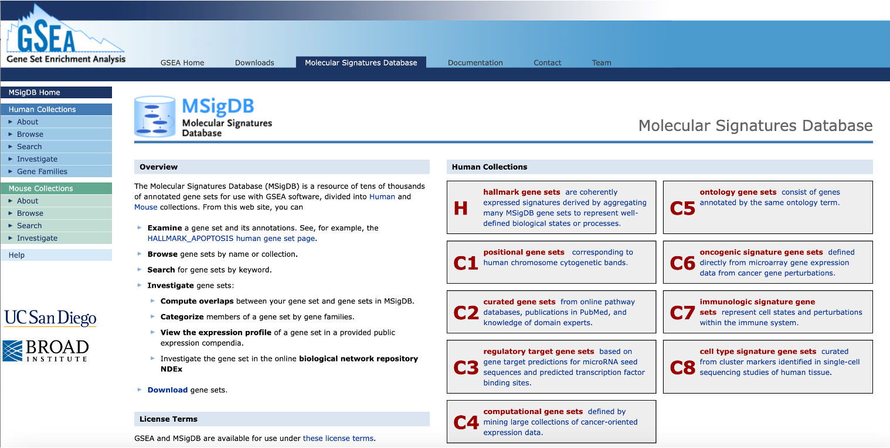
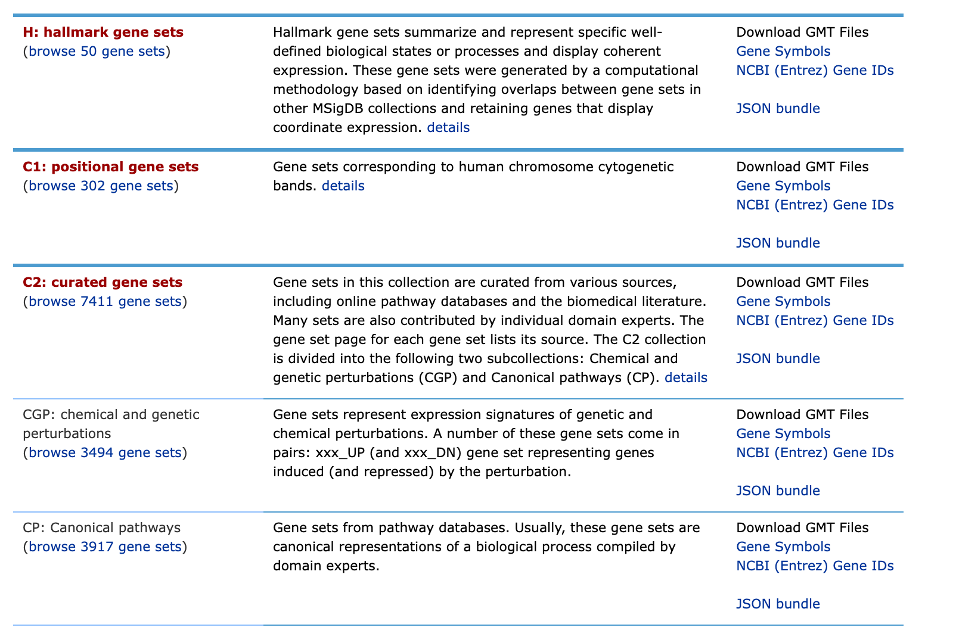

```{r setup, include=FALSE}
knitr::opts_chunk$set(
  tidy = TRUE,
  tidy.opts = list(width.cutoff = 95),
  message = FALSE,
  warning = FALSE,
  time_it = TRUE,
  error = TRUE,
  echo = TRUE,
  class.output = ".bordered",
  fig.align = 'center'
)
```

```{r, include=FALSE}

suppressWarnings({
  library(kableExtra)
  library(tidyr)
  library(dplyr)
  library(edgeR)
  library(pheatmap)
  library(ggplot2)
  library(googledrive)
  library(GenomicRanges)
  library(plyranges)
})  
  
```

```{r, include=FALSE}

# Load the data again
dds <- readRDS("../results/dds_object.rds")

samples <- read.csv("../results/samples_table.csv")

# Re-create design
sample_group <- factor(samples$groups, levels=c("N_crypts", "K_org"))

design <- model.matrix(~sample_group)
```

## Objetives

-   Downstream analysis of differential expression data
-   Perform gene ontology analysis on interesting gene groups
-   Perform gene set enrichment analysis (GSEA)
-   Inspecting data with Integrative Genome Viewer (IGV)

## Further downstream analyses

Once we have our differentially enriched regions, we can perform various downstream analyses to check the **functional aspects** of the group of regions which are up- or down-regulated in our condition of interest.

#### Loading tables

For these analyses, we will need to upload additional tables, that have been generated separately by us in order to speed up some computations and save memory.
We introduced the content of these files on the first day, here we'll do a brief recap.

1.  `recurrence_chr12.matrix`: this is a table where you can find if any of the regions that constitute the **consensus set of enhancer regions** is identified as enhancers also **in the individual samples**.

2.  `Korg_UP_regions_results.txt` and `Ncr_UP_regions_results.txt`: these files store the differential analysis results for the **entire set of enhancers across all the genome** and not only chr12 and, importantly, the regions listed in these files are annotated to gene symbols (we will talk about genomic region annotation later).

Import these files as R objects

```{r, eval=TRUE}
recurrence_table <- read.table('../MBMM25_uploadata//recurrence_chr12.matrix', sep='\t')
```

```{r, include=FALSE}
# tumor_up_res <- files[files$name == 'Korg_UP_regions_results.txt',] %>%
#   drive_read_string() %>% read.delim(text = ., sep='\t', header=TRUE)
# 
# tumor_down_res <- files[files$name == 'Ncr_UP_regions_results.txt',] %>%
#   drive_read_string() %>% read.delim(text = ., sep='\t', header=TRUE)
```

```{r, eval=TRUE}
tumor_up_res <- read.table('../MBMM25_uploadata/Korg_UP_regions_results.txt', sep='\t', header=TRUE, quote = "" )
tumor_down_res <- read.table('../MBMM25_uploadata/Ncr_UP_regions_results.txt', sep='\t', header=TRUE, quote = "")
```

## Understanding recurrence of enhancer regions across patients

As the paper presenting our studies reports:

> "To identify common epigenetic blueprints across the organoid library, we looked at the **concordance** of tumor-enriched enhancers in the PDOs (Patient-Derived Organoids)."

One of the downstream analyses that has been performed on the tumor-enriched enhancers (i.e. the enhancers with significantly higher H3K27ac signal compared to normal colon tissues) was aimed at understanding if there is a **signature of genomic regions that are highly conserved and consistently active in the entire library of PDOs**, which represent an especially interesting subset of regions being the **most conserved enhancers**.

In order to perform this analysis, we need to start from a binary table that indicates for each genomic region (i.e., the rows), if it was called as enhancer in each separate sample (i.e., the columns).
This is our recurrence table:

```{r, eval=FALSE}
dim(recurrence_table)
head(recurrence_table, 5)
```

```{r, echo=FALSE}
head(recurrence_table, 5) %>% kbl() %>% kable_styling()
```

In order to get the number of PDO samples and normal samples that share each genomic region in the consensus, we need to calculate the **row-wise sum** of all the '1's in the table.
\> We have already performed this step for you: you can see the row-sums in the last two columns of the table, named 'Called_Korg' and 'Called_Ncr' respectively for tumor and normal sample counts.

We will first extract the upregulated regions for chr12 using certain thresholds.
Then we will retrieve information regarding the recurrence of these regions across all PDOs.

At this point we can use this code to generate a **pie chart** that illustrates the recurrence of the up-regulated regions across samples.

```{r}
res <- read.table('../results/res_chr12.csv', header = TRUE, sep = '\t')
rownames(res) <- res$PeakID
head(res)

up_regions <- res %>% dplyr::filter(logFC >= 2 & PValue < 0.01) %>% rownames()
```

Tabulate information on the proportion of enhancers in each category.

```{r}
library(dplyr)
# Filter the recurrence table for the significantly enriched enhancers in tumor samples and select only the columns with the row-sums

rec_df <- recurrence_table[up_regions,] %>% 
    dplyr::select(contains("Called")) %>%
    # Create a new column that group regions based on the extent of recurrence across samples
    dplyr::mutate(group=case_when(Called_Korg%in%c(1:4) ~ "1-4",
                         Called_Korg%in%c(5:7) ~ "5-7",
                         TRUE ~ "8-10")) %>%
    # Aggregate regions based on the group
    dplyr::group_by(group) %>% 
    dplyr::tally() %>% 
    dplyr::mutate(n=as.numeric(n)) %>%
    dplyr::arrange(desc(group)) %>% 
    # Calculate frequencies for each group of regions
    dplyr::mutate(prop = n / sum(n) *100) %>% 
    # Compute cumulative sum
    dplyr::mutate(cumsum = cumsum(prop) ) %>% 
    dplyr::mutate(ypos = cumsum(prop)- 0.5*prop ) # To position the label at the middle of the slice 


```

Draw the plot.

In defining the polar coordinates:
  
  - theta = variable to map angle to
  
  - start = Offset of starting point from 12 o'clock in radians
  
  - direction = clockwise or anti-clockwise.

```{r}
# Make plot

rec_pie <- ggplot(rec_df, aes(x="", y=prop, fill=group)) +
geom_bar(stat='identity', width=1, color='white') +
coord_polar(theta="y", start=0, direction=1) +
theme_void() +
theme(legend.position="none") +
geom_text(aes(y = ypos, label = group), color = "white", size=10) +
scale_fill_manual(values=c('orange2','coral3','red4'))

rec_pie
```


A pie chart is a stacked bar chart with polar coordinates (**a 2D coordinate system** where each point is defined by its **distance** from a central point (the pole) and the **angle** it makes with a reference line (the polar axis).

> Try to draw the stacked bar chart alone

```{r fig.width=4, fig.height=4, include=FALSE}
rec_pie <- 
ggplot(rec_df, aes(x="", y=prop, fill=group)) +
geom_bar(stat='identity', width=1, color='white') +
geom_text(aes(y = ypos, label = group), color = "white", size=10)

rec_pie
  
```


```{r, fig.width=4, fig.height=4, include=FALSE}

rec_pie <-ggplot(rec_df, aes(x="", y=prop, fill=group)) +
geom_bar(stat='identity', width=1, color='white') +
geom_text(aes(y = ypos, label = group), color = "white", size=10)

rec_pie
```

We can print the frequencies as percentages, as we have calculated them in the above code.

```{r, eval=FALSE}
rec_df %>% dplyr::select(group, n, prop)
```

```{r, echo=FALSE}
rec_df %>% dplyr::select(group, n, prop) %>% kbl() %>% kable_styling()
```

As we can see from the table, there is a subset of enhancers, 20% of the upregulated enhancers in chromosome 12, which are consistently highly enriched in 8-to-10 tumor organoids compared to the normal colon (10 is the total number of PDOs examined in thatstudy).
This *core* set of regions constitute a particularly interesting signature that likely **drives the regulation of relevant genes in CRC tumor cells**.

## Annotating genomic regions to genes

One of the key steps when dealing with genomic features is their **annotation** to actual genes.
Annotating genomic regions to genes involves the process of **identifying and labeling specific regions of the genome with the genes they correspond to**.
This facilitates the process of understanding the genomic context of genes, including their regulation, and function.

One of the most *reliable* ways to annotate genomic regions to genes is **through experimental techniques** that directly measure interactions or associations between genomic elements and genes.
**Chromosome Conformation Capture** (3C) techniques, in particular, can capture physical interactions between distant genomic regions, helping to identify enhancer-promoter interactions and other long-range interactions.

> Annotating genomic regions to genes is a complex task that often requires a combination of experimental data and statistical analysis to establish associations.

Often, however, it is not easy to retrieve experimental data to annotate genomic regions to genes.
In such case, the best strategy is to associate these regions to **nearby genes**.
The annotation by **TSS proximity** is an approximation of the reality, but nevertheless serves as a good starting point for subsequent interpretations of the functional implications derived by the annotation.

> For instance, researchers may investigate how regulatory elements affect gene expression or how genetic variants within regulatory regions impact gene function.

### Enhancer distribution across known genomic features

In our case, the annotation to nearby TSS has already been performed using an external tool called `Homer`, which enables the annotation of regions to genes, but also the **annotation of their genomic position with respect to relevant genomic features**, like introns, exons, promoter-TSS regions, etc.

We will now check how our upregulated enhancers in tumor organoids are distributed across these genomic features, by plotting another pie chart.

```{r}
# Subset upregulated regions
df_anno <- tumor_up_res %>%
  group_by(annotation) %>% tally() %>%
  filter(annotation!='NA') %>%
  # Compute percentages
  mutate(fraction = n/sum(n)) %>%   
  # Compute the cumulative percentages (top of each rectangle)
  mutate(ymax=cumsum(fraction)) %>%
  # Compute the bottom of each rectangle
  mutate(ymin=c(0, head(ymax, n=-1)))

df_anno
```

```{r}
# Make the plot
# Try to remove the coord_polar to understand how the chart is built initially
# Try to remove xlim to see how to make a pie chart

anno_rect <- ggplot(df_anno, aes(ymax=ymax, ymin=ymin, xmax=4, xmin=3, fill=annotation)) +
  geom_rect() +
  coord_polar(theta="y") +
  xlim(c(2, 4)) +
  scale_fill_brewer(palette=4)
  #theme_void()

# Print plot
anno_rect
```

Try to draw the same plot as stacked barplot

```{r, include=TRUE}

#xlim, increase the x-axis range to shrink the plotted rectangle, creating a hole in the middle

# Make the plot
anno_rect <- ggplot(df_anno, aes("", y=fraction, fill=annotation)) +
  geom_bar(stat='identity', width=1, color='white') +
  scale_fill_brewer(palette=4)

# Print plot
anno_rect
```

> What is the genomic feature that harbors the majority of upregulated enhancer regions?

> Interpreting a long list of genes can be challenging because assessing each gene individually can not easily capture the key biological mechanisms underlying distinct phenotypes.

<center></center>

Various computational approaches have been developed to assess the broader biological context of findings from omics experiments.
Once we have our differentially expressed genes, we can perform downstream analyses to check the **functional aspects** of the group of genes which are up- or down-regulated in our condition of interest.
In the following sections, we will go through two of these, Gene Set Enrichment Analysis (GSEA) and Gene Ontology Enrichment Analysis (GO).

We can then start addresing some interesting questions:

-   *What is the function of the differentially expressed genes?*

-   *What can they tell us regarding the molecular/phenotypic differences between our groups of interest?*

-   *Do they belong to specific ontologies or pathways?*

## Enrichment analysis using GSEA

Gene Set Enrichment Analysis - [GSEA](https://www.gsea-msigdb.org/gsea/index.jsp) is a computational methods that determines whether any *a priori* defined geneset shows statistically significant differences between two biological states (e.g. phenotypes).

In other words...

...if it is enriched at the top of a list of genes ordered on the basis of expression differences between two groups

<center>(*The web interface for GSEA*)</center>

The following image adapted from the [original publication](https://www.pnas.org/doi/10.1073/pnas.0506580102) illustrates the main steps in GSEA.

<center></center>

To answer if members of a gene set occur towards the top or bottom of the ranked list of genes, we need:

1.  ranked list of differentially expressed genes (e.g. based on logFold Change or P-value)
2.  gene sets defined based on prior biological knowledge

### Ranked list of genes

Normally we would perform **Pre-ranked GSEA** using all regions tested for differential analysis, ranked by their -log10(p-adjusted value) \* the sign of the log2FoldChange, e.g. significantly upregulated regions are at the top of the rank whilst significantly downregulated ones are at the bottom.

Here, we will merge the gained and lost regions and rank them.
Given that we are dealing with regions and not genes, it is possible that multiple regions are annotated to the same gene.
Thus, duplicate genes need to be removed from the ranking list.
In doing so, we will keep the region with the most significant padj value, e.g. max(abs(padj x FC)).

The aim is to check if a previously reported gene set of colorectal cancer is significantly enriched in the target genes of enhancers that are gained in our CRC samples.
To run GSEA, we will use the `fgsea` package.

We will retrieve gene sets from the Molecular Signatures Database (MSigDB)

```{r}
# Rank the genes based on their padj x sign(log2FC)

ranked <- rbind(tumor_up_res, tumor_down_res) %>% 
  select(Gene.Name, log2FoldChange, padjxFC) %>%
  filter(!Gene.Name=="") %>%
  mutate(abs = abs(padjxFC)) %>%
  #arrange(desc(abs)) %>%
  arrange(desc(padjxFC)) %>%
  group_by(Gene.Name) %>% 
  filter(row_number() == 1) %>% 
  #arrange(desc(padjxFC)) %>%
  #tibble::column_to_rownames('Gene.Name') %>%
  #filter(Gene.Name=='ARHGEF16')
  pull(padjxFC, Gene.Name)
  
head(ranked)
tail(ranked)

```

```{r, include=FALSE}

# all <- read.table("../Mar24/Korg_Ntissue_results.txt", sep="\t", header=FALSE)
# colnames(all) <- c('chr', 'start', 'end', 'id', 'sign', 'baseMean', 'log2FoldChange', 'lfcSE', 'stat', 'pval', 'padj', 'padjxFC', 'region', 'annotation', 'Gene.Name', 'biotype', 'recurK', 'recurN')
# head(all)
# 
# # Rank the genes based on their padj x sign(log2FC)
# ranked <- all %>% 
#   filter(!is.na(Gene.Name) & !is.na(padj)) %>%
#   select(Gene.Name, log2FoldChange, padjxFC) %>%
#   mutate(abs = abs(padjxFC)) %>%
#   #arrange(desc(abs)) %>%
#   arrange(desc(padjxFC)) %>%
#   group_by(Gene.Name) %>% 
#   filter(row_number() == 1) %>% 
#   #arrange(desc(padjxFC)) %>%
#   #tibble::column_to_rownames('Gene.Name') %>%
#   #filter(Gene.Name=='ARHGEF16')
#   pull(padjxFC, Gene.Name)
#   
# length(ranked)
# head(ranked)
# tail(ranked)

```

### MSignDB signatures

We will first retrieve gene sets from the Molecular Signatures Database (MSigDB), a resource of tens of thousands of annotated gene sets for use with GSEA software, divided into Human and Mouse collections.
In order to extract the gene set without the need to directly download it, we are going to access MSigDB directly from R using another package called msigdbr.

<center>(*The web interface for MSigDB*)</center>

There are 35,134 gene sets (number constantly increases) in the Human MSigDB that are divided into 9 major collections.

<center>(*Human MSigDB Collections*)</center>

Install and import libraries for fgsea and msigdbr

```{r, eval=FALSE}
if (!require(fgsea, quiet=TRUE))
  BiocManager::install("fgsea")
```

```{r, eval=FALSE}
if (!require(msigdbr, quiet=TRUE))
  install.packages("msigdbr")
```

Extract the curated gene sets (C2) from the MSigDB database, subcollection Chemical and Genetic Perturbations.

```{r}
library(msigdbr)
# Extract specific gene sets from the MSigDB database
curated_gsets <- msigdbr(species = "human", category = "C2", subcategory = 'CGP')
```

Inspect the information and gene sets we retrieved.

```{r}
names(curated_gsets)
curated_gsets %>% pull(gs_name) %>% unique() %>% head(2)
```

Check if there are any gene sets related to Colon Cancer.

```{r}
curated_gsets %>% filter(grepl('COLON_AND_RECTAL',gs_name)) %>% head()
```

```{r, include=FALSE}
# # Filter the oncogenic gene sets for the gene set of our interest
# gene_set_name <- "WNT_UP.V1_UP"
# tex_sig_df <- oncogenic_gsets %>% filter(gs_name == gene_set_name)
# tex_sig_df
```

We will filter the curated gene sets for the gene sets of our interest and then prepare a list retrieving the genes that are contained in each geneset (shown in the `gs_name` column).

```{r, eval=FALSE, include=FALSE}
# Filter the curated gene sets for the gene set of our interest
gene_set_name <- c("GRADE_COLON_AND_RECTAL_CANCER_UP", "GRADE_COLON_AND_RECTAL_CANCER_DN")
tex_sig_df <- curated_gsets %>% filter(gs_name %in% gene_set_name)
head(tex_sig_df,2)
```

We will filter the curated gene sets for the gene sets of our interest and then prepare a list retrieving the genes that are contained in each geneset (shown in the `gs_name` column).

```{r}
# Define gene sets of interest
gene_set_name <- c("GRADE_COLON_AND_RECTAL_CANCER_UP", "GRADE_COLON_AND_RECTAL_CANCER_DN")

# Create an empty gene set list
gset <- list()

# For each gene set retrieve the gene symbols and store them in the gset list.

for (gs in gene_set_name) {
  
  # Filter the curated gene sets for the gene set of our interest
  tmp <- curated_gsets %>% filter(gs_name==gs)
  
  # retrieve gene symbols
  tmp_gset <- list(tmp$gene_symbol)    
  #names(tmp_gset) <- gene_set_name
  
  # add the genes in the gset list
  gset[gs] <- tmp_gset
}
```

```{r}
# Retrieve the number of genes in each element of the list
lapply(gset, length)
gset
```

Run GSEA on our ranked list of genes using the gene sets we retrieve from MSigDB.
Here, we set the number of permutations to 1000.

```{r}

library(fgsea)
# Run GSEA
fgseaRes <- fgsea(pathways = gset, 
                  stats    = ranked,
                  nperm = 1000
                  )
```

Inspect the results for each geneset, which include the normalized enrichment score (NES) and nominal P-value using 1000 permutations.

```{r}
# Take a look at results
fgseaRes
```

Plot GSEA results

```{r, fig.width=6}
# Plot GSEA results

for (gs in unique(gene_set_name)){
  print(plotEnrichment(gset[[gs]],
               ranked) + labs(title=gs))
}

```

The GSEA results show that the **GRADE_COLON_AND_RECTAL_CANCER** genesets are enriched in the genes corresponding to the gained and lost enhancers in our dataset.
The geneset derives from a [study](https://www.gsea-msigdb.org/gsea/msigdb/human/geneset/GRADE_COLON_AND_RECTAL_CANCER_UP.html?ex=1), in which they used oligonucleotide microarrays to profile human rectal and colon carcinoma tumors compared to normal mucosa samples.

> Can you retrieve the leading edge genes from the reuslts?

```{r, include=FALSE}
fgseaRes$leadingEdge
```

## Gene Ontology or Pathway Enrichment Analyses (over representation)

To obtain further **biological insights related to gene regulation** we can perform Gene Ontology or Pathway Enrichment analyses.
We will try to get a more *unsupervised* look at what kind of biological processes are captured by the upregulated genes in primary CRC.

We will do this using the `gProfiler` package in `R`.

> **Gene Ontology** is a standardized system for **annotating genes with terms** describing their biological attributes.
> These terms are organized into three main categories: **Molecular Function** (the biochemical activity of the gene product), **Biological Process** (the broader biological objectives the gene contributes to), and **Cellular Component** (the location where the gene product is active).

The *enrichment* is evaluated in this way: a list of genes is compared against a background set of genes (e.g., all genes in the genome) to identify GO terms that are **significantly overrepresented in the list of interest**.

> Statistical tests, such as Fisher's exact test or hypergeometric test, are commonly used to determine whether the observed number of genes associated with a particular GO term in the gene list is significantly higher than expected by chance.

The output of GO enrichment analysis includes a list of significantly enriched GO terms along with statistical metrics, such as p-values or false discovery rates (FDR).

> This information helps to prioritize genes for further study and provides further context to the experimental results!

### gProfiler

First, we will **create a custom function** that takes as input a list of genes and automatically run the `gProfiler` function responsible for calulating the enrichment and also creating two plots: one that generally describes the categories of enriched terms, and another one more specific for **enriched pathways from KEGG** (aka, *Kyoto Encyclopedia of Genes and Genomes*).

```{r, include=FALSE}
#significant = output only significant
#correction_method = appropriate for query lists, since GO terms are not independent
#domain scope = Statistical domain size N describes the total number of genes used for random selection and is one of the #four parameters for the hypergeometric probability function of statistical significance used in g:GOSt. Only genes with #at least one annotation to be part of the domain.

```

```{r}
# Result data.frames will be stored in this object 
gprof <- c()

#genes: provide a character vector with gene names
#geneListName: a character identifying the list of genes that will be used to name the data.frame stored in res and to create the pdf

gprofiler <- function(genes, geneListName) {
  
  #Parameters you might want to change:
  #ordered_query: if the gene list provided is ranked 
  #evcodes: if you want to have the gene ids that intersect between the query and the term
  #custom_bg: the gene universe used as a background
  
  # Run the Main Function of gProfiler
  gostres <- gost(query =unique(as.character(genes)), 
                  organism = "hsapiens", ordered_query = FALSE, 
                  multi_query = FALSE, significant = TRUE, exclude_iea = FALSE, 
                  measure_underrepresentation = FALSE, evcodes = TRUE , 
                  user_threshold = 0.05, correction_method = "g_SCS", 
                  domain_scope = "annotated", custom_bg = NULL, 
                  numeric_ns = "", sources = NULL, as_short_link = FALSE)
  
  # Create the overview plot (not interactive)
  gostplot <- gostplot(gostres, capped = TRUE, interactive = F)
  
  # Keep only useful columns from the gostres object
  # The gostres object is a list with $results and $metadata
  
  gostres.head <- gostres$result %>% head()
  
  gp_mod <- gostres$result[,c("query", "source", "term_id",
                             "term_name", "p_value", "query_size", 
                             "intersection_size", "term_size", 
                             "effective_domain_size", "intersection")]

  gp_mod$query <- geneListName
  
  # Calculate GeneRatio for the dotplot: number of genes intersecting the term/ total number of unique genes provided
  gp_mod$GeneRatio <- gp_mod$intersection_size/gp_mod$query_size
  
  # Number of genes within the term / number of all unique genes across all terms (universe)
  gp_mod$BgRatio <- paste0(gp_mod$term_size, "/", gp_mod$effective_domain_size)
  
  # Rename columns
  names(gp_mod) <- c("Cluster", "Category", "ID", "Description", "p.adjust", "query_size", "Intersection_size", "term_size", "effective_domain_size", "intersection", "GeneRatio", "BgRatio")
  
  # Save the results data.frame in res
  gprof[[geneListName]] <<- gp_mod
  
  # Remove possible duplicate terms for plotting
  
  gp_mod %>% arrange(p.adjust) %>%
    group_by(Description) %>%
    filter(row_number() == 1) %>%
    ungroup()
  
  # The following code will remove all records for duplicated terms!
  # omit_ids <- gp_mod[duplicated(gp_mod$Description), ]
  # omit_ids_list <- omit_ids$Description
  # gp_mod <- gp_mod[!gp_mod$Description %in% omit_ids_list,]

  
  go_table_pathways <- filter(gp_mod, Category %in% c('KEGG'))
  
  # Calculate negLog P-Value and rank terms based on this value  
  go_table_pathways$negLogPval=-log10(go_table_pathways$p.adjust)
  go_table_pathways <- go_table_pathways[order(-go_table_pathways$negLogPval),]
  
  # Make dot plot
  dotPlot <- arrange(go_table_pathways, negLogPval) %>%
    mutate(Description = factor(.$Description, levels = .$Description)) %>%
    ggplot(aes(negLogPval, Description)) +
    geom_point(aes(color = negLogPval, size = GeneRatio))+
    scale_size(range = c(5, 9)) +
    scale_color_gradient(low="blue", high="red")+
    theme_light()+
    ylab('Pathway')+
    theme(axis.text.y=element_text(size = 10),
          axis.text.x=element_text(size = 7),
          legend.text = element_text(size = 7),
          legend.title = element_text(face = 'bold'))

# Print on display
return(list(gostplot, dotPlot, gostres.head))
}

```

Now, let's extract a *vector* of genes associated to the most recurrent regulatory enhancers up-regulated in tumor samples, and perform the analysis:

```{r}
# Extract regions with high recurrence (from all chromosomes)
all_enh_recur <- tumor_up_res %>% 
  filter(padj < 0.05 & log2FoldChange > 0 & Called_Korg >=8)

# Extract corresponding genes
genes_up_recur <- all_enh_recur %>%
  filter(!is.na(Gene.Name)) %>% 
  pull(Gene.Name) %>% unique()

```

We can check the number of genes that we have retrieved.
We'll relate this to the number of regions we start with.

```{r}
paste("Number of recurrent enhancers:", length(all_enh_recur$PeakID))

paste("Number of genes associated to the recurrent enhancers:", length(genes_up_recur))

```

> 💡 Can you make a consideration about the differences between the number of regions and the number of corresponding genes?

We can now run the function created above to obtain our enriched biological pathways.

```{r}
# Load package
library(gprofiler2)

# Run custom function
gprofiler(genes = genes_up_recur, geneListName = 'genes_up_recur')
```

Here, interestingly, we find that the two most enriched biological pathways are "colorectal cancer" and "Hippo signalling pathway".

From this insight we can start to **generate new hypotheses**, like the one tested in the study about the relevance of YAP/TAZ factors, which are indeed key downstream effectors of the Hippo signalling.

> 💡 GO analyses might highlight very interesting patterns and generate hypotheses, but are many times quite hard to interpret depending also on the biological system we are studying.

What information did we retrieve from the analysis?

All information is stored in the *genes_up_recur* table

```{r}
gprof$genes_up_recur %>% colnames()
```

We can summarize the number of hits for each pathway category

```{r}
dim(gprof$genes_up_recur)

#The following lines of code provide the same output
table(gprof$genes_up_recur$Category)
gprof$genes_up_recur %>% group_by(Category) %>% tally()

```

Let's retrieve the KEGG pathways

```{r}

gprof$genes_up_recur %>% dplyr::filter(Category=="KEGG") %>% head(6) %>% kbl() %>% kable_styling()

```

```{r, include=FALSE}
#significant = output only significant
#correction_method = appropriate for query lists, since GO terms are not independent
#domain scope = Statistical domain size N describes the total number of genes used for random selection and is one of the #four parameters for the hypergeometric probability function of statistical significance used in g:GOSt. Only genes with #at least one annotation to be part of the domain.

```

Can you retrieve the differentially expressed genes that are part of the Hippo signaling pathway?

```{r, echo=FALSE}
gprof$genes_up_recur %>% filter(Description=='Hippo signaling pathway') %>% pull(intersection)
```

```{r, echo=FALSE}
gprof$genes_up_recur %>% filter(Description=='Colorectal cancer') %>% pull(intersection)
```

Run enrichment analysis for regions with recurrence in at least 5/10 tumor samples

```{r, echo=FALSE}
# Extract regions with high recurrence (from all chromosomes)
all_enh_recur5 <- tumor_up_res %>% 
  filter(padj < 0.05 & log2FoldChange > 0 & Called_Korg >=5)

# Extract corresponding genes
genes_up_recur5 <- all_enh_recur5 %>%
  filter(!is.na(Gene.Name)) %>% 
  pull(Gene.Name) %>% unique()

# Run custom function
gprofiler(genes = genes_up_recur5, geneListName = 'genes_up_recur5')
```

```{r}
# What class is gprof?
class(gprof)
# What are the dimensions of the elements in gprof?
lapply(gprof, dim)
```

> 💡 You can use another tool for gene ontology analysis called `clusterProfiler`.

### clusterProfiler

```{r, eval=FALSE, include=FALSE}
#  suppressPackageStartupMessages(
#   BiocManager::install("clusterProfiler")
# )
```

#### Gene Ontology

```{r, eval=TRUE, include=TRUE}
library(org.Hs.eg.db)
library(clusterProfiler)

# Molecular Function, use "BP" or "CC" for Biological Process or Cellular Component
ontology="BP"

# Perform gene ontology enrichment
ego <- enrichGO(gene = genes_up_recur,
                 OrgDb = org.Hs.eg.db,
                keyType = 'SYMBOL',
                ont = ontology,
                pAdjustMethod = "BH",
                 pvalueCutoff = 0.05,
                 qvalueCutoff = 0.05
                 )

```

```{r, eval=FALSE, include=TRUE}
head(ego@result,2)
```

```{r, eval=TRUE, echo=FALSE}
head(ego@result,2) %>% kbl() %>% kable_styling()
```

Let’s now plot the results with a ranked dotplot.
Gene ontology terms are ranked from the top to the bottom based on the Gene Ratio (number of genes intersecting the term / total number of unique genes provided).
The significance of the enrichment (p.adjust) is depicted by the color, whilst the size of the dot represents the number of genes in our geneset (e.g. up-regulated genes) that overlap the specific GO term.

```{r, eval=FALSE, include=FALSE}
library(enrichplot)
enrichplot::dotplot(ego, showCategory=10) 
#+ ggtitle(paste0("Dotplot for GO-", ontology, "enrichment"))
```

We can also create a directed acyclic graph (DAG)

```{r, eval=TRUE, include=TRUE}
library(clusterProfiler)
# Plot results of gene ontology enrichment
clusterProfiler::plotGOgraph(ego, firstSigNodes=10)
```

#### Save plot as PDF file

```{r, eval=TRUE, include=TRUE}
# Open the file device
pdf("../results/GO_graph.pdf", width = 10, height = 8)

# Generate the plot
clusterProfiler::plotGOgraph(ego, firstSigNodes = 10)

# Close the device (this actually saves the file)
dev.off()

```

#### KEGG pathway

```{r}
 # Perform gene ontology enrichment

ids <- clusterProfiler::bitr(genes_up_recur, fromType="SYMBOL", toType="ENTREZID", OrgDb="org.Hs.eg.db")

 kegg <- enrichKEGG(gene = ids$ENTREZID,
                   organism = 'hsa',
                  pvalueCutoff = 0.05
                 )
```

```{r, eval=FALSE}
head(kegg,4)
```

```{r, echo=FALSE}
head(kegg,4) %>% kbl() %>% kable_styling()
```


```{r, eval=TRUE, include=TRUE}
dotplot(kegg, showCategory=10) + ggtitle(paste0("Dotplot for GO - ", ontology, " enrichment"))
```

## Region annotation with ChIPpeakAnno

We will try an alternative approach to annotate our enhancer regions leveraging the BioConductor package ChIPpeakAnno.
First we create a GRanges object of the upregulated regions.

```{r}

up.gr <- makeGRangesFromDataFrame(tumor_up_res, keep.extra.columns = TRUE)
up.gr %>% head(2)

```

```{r}
# Load the library

# if (!require(ChIPpeakAnno))
#   BiocManager::install("ChIPpeakAnno")

library(ChIPpeakAnno)
```

To perform the annotation we need to incorporate information on gene structure and positions.
We will import the annotation package for human assembly hg38 version 86 from Ensembl.

```{r, eval=FALSE, include=FALSE}
# if (!require(EnsDb.Hsapiens.v86))
#   BiocManager::install("EnsDb.Hsapiens.v86")

#library(EnsDb.Hsapiens.v86)
#library(ensembldb) 

# If dplyr is also loaded, ensure you are using the correct function with double colon, e.g. ensembldb
#ensembl.hs86.transcript <- transcripts(EnsDb.Hsapiens.v86)

```


```{r}
# Use Ensembl annotation package:

library(EnsDb.Hsapiens.v86)
library(ensembldb) 

ensembl.hs86.gene <- ensembldb::genes(EnsDb.Hsapiens.v86)
```

```{r}
# Use Ensembl annotation package:
up_peak_ensembl <- annotatePeakInBatch(up.gr, 
                                         AnnotationData = ensembl.hs86.gene)
head(up_peak_ensembl, n = 2)
```

```{r, echo=FALSE}
head(up_peak_ensembl, n = 2) %>% kbl() %>% kable_styling()
```


```{r, eval=FALSE, include=FALSE}
if (!require(biomaRt))
  BiocManager::install("biomaRt")

```

We can now annotate the Ensembl IDs with the corresponding gene symbols.
Here, we will use the org.Hs.eg.db database.

```{r, include=FALSE, eval=FALSE}
library(biomaRt)
# mart <- useMart(biomart = "ENSEMBL_MART_ENSEMBL",
                # dataset = "hsapiens_gene_ensembl")
```

```{r, include=FALSE, eval=FALSE}
if (!require("org.Hs.eg.db", quietly = TRUE))
    BiocManager::install("org.Hs.eg.db")
```

```{r}
library(org.Hs.eg.db)
# Use Ensembl annotation package:
up_peak_ensembl <- addGeneIDs(annotatedPeak = up_peak_ensembl,
                                orgAnn = "org.Hs.eg.db",
                                feature_id_type = "ensembl_gene_id",
                                IDs2Add = "symbol")

head(up_peak_ensembl, n = 2)
```

```{r, echo=FALSE}
head(up_peak_ensembl, n = 2) %>% kbl() %>% kable_styling()
```


Compare the annotation we got from HOMER (`Gene.Name` column) to the annotation from ChIPpeakAnno (`symbol` column).
You can generate a data.frame object for better visualization.

```{r}
up_peak_ensembl %>% dplyr::select(region, annotation, Gene.Name, symbol) %>% head()
```

```{r, echo=FALSE}
up_peak_ensembl %>% dplyr::select(region, annotation, Gene.Name, symbol) %>% head() %>% kbl() %>% kable_styling()
```


> Why do you think there are differences in the annotation?

## Take-home Messages 🏠

**Congratulations!** You got the end of the course and now hopefully know some crucial aspects of a ChIP-seq analysis workflow!
Some of the key concepts that we have explored during the course can enable us to reach some distilled points of interest:

-   Design your experiments carefully with data analysis in mind!

-   Data needs to be carefully explored to avoid systematic errors in the analyses!

-   Plot and Visualize as much as possible!

-   Not all information is useful, remember that it all depends on the biological question!

-   Omics outputs are immensely rich and one experiment can be used to answer a plethora of questions!
