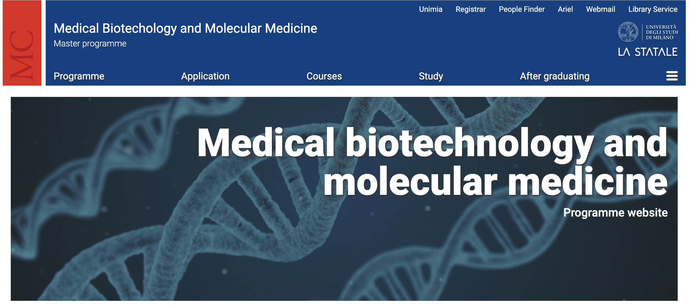

```{r setup, include=FALSE}
knitr::opts_chunk$set(engine = 'R', echo = TRUE, fig.align = 'center', warning = FALSE, message = FALSE)
```

Welcome! This page has been created as part of the [Unimi course](https://www.unimi.it/it/corsi/altre_offerte/aa-2024/2025/medical-biotechnology-and-molecular-medicine-classe-lm-9-immatricolati-dallanno-accademico-2024-25) "*Medical Biotechnology and Molecular Medicine*".

<center>

{width="421"}

</center>

The aim is to introduce you to bioinformatics and to some of the most important concepts related to the **analysis of Next Generation Sequencing (NGS) data**. 

You will be guided through the analytical workflows of **ChIP-seq** and **Single cell RNA-seq** datasets. The hands-on part is based on `R` and therefore an essential introduction to this programming language will be provided.

The ChIP dataset used in this workshop is taken from [our study](https://www.nature.com/articles/s41467-021-22544-y#MOESM1) published on *Nature Communications* in 2021, "*Epigenomic landscape of human colorectal cancer unveils an aberrant core of pan-cancer enhancers orchestrated by YAP/TAZ*". Part of the exercises will be dedicated to reproducing some relevant analyses and plots published as results. The scRNA-seq workflow will be based on Seurat Tutorials found [here](https://satijalab.org/seurat/articles/pbmc3k_tutorial).


# Learning Objectives

1. Familiarize with basic R functions
2. Working with genomic coordinates
3. Get an overview of the ChIP-seq assay and its significance in genomic research
4. Understand applications and key insights derived from ChIP-seq experiments
5. Describe the core steps of a ChIP-seq data analysis pipeline
6. Learn how to navigate and utilize public resources for the analysis and exploration of genomic data
7. Understand the key steps in scRNA-seq data analysis


# Workshop Schedule

This workshop is intended as a three-day tutorial. Each day will be dedicated to specific activities:

### Day 1

-   Introduction to R and RStudio
-   Install, and use R packages and functions
-   Work with tidyverse packages such as dplyr and ggplot
-   Load files and save R objects
-   Inspect and manipulate a dataframe using dplyr
-   Create plots to visualize data using ggplot2

-   Introduction to Genomic Ranges
-   Explore main functions for handling GRanges objects
-   Work with GRanges and dplyr
-   Import and inspect a GTF file
-   Define TSS genomic positions
-   Intersect TSS windows with TF-bound genomic intervals
-   Resources for omics data


### Day 2 and 3

-   Introduction to ChIP-seq
-   Dataset introduction and exploration
-   Data normalization with `edgeR`
-   Diagnostic and exploratory analysis
-   Understand the theory behind differential analysis in ChIP-seq
-   Perform differential analysis using `edgeR`
-   Visualize the results
-   Downstream analyses of differentially expressed genes
-   Perform gene ontology analysis on interesting gene groups
-   Perform gene set enrichment analysis
-   Inspecting data with Integrative Genome Viewer
-   Genomic visualization in R


### Day 4 and 5

-   Introduction to single cell RNA sequencing
-   The Seurat object
-   Analysis of the PBMC 3K dataset


# Credits

This workshop was inspired by other tutorials on ChIP-seq data analysis ([the Bioconductor course](https://www.bioconductor.org/help/course-materials/2016/CSAMA/lab-5-chipseq/Epigenetics.html), the teaching material from the [HBC training](https://github.com/hbctraining/Intro-to-ChIPseq/blob/master/schedule/3-day.md), the [tutorial from UCR](http://biocluster.ucr.edu/~rkaundal/workshops/R_feb2016/ChIPseq/ChIPseq.html), the [vignette of the GenomicRanges Package](https://bioconductor.org/packages/devel/bioc/vignettes/GenomicRanges/inst/doc/GenomicRangesIntroduction.html), and the [Gviz User Guide](https://bioconductor.org/packages/devel/bioc/vignettes/Gviz/inst/doc/Gviz.html). For the R fundamentals part look at this [R book for beginners](https://bookdown.org/daniel_dauber_io/r4np_book/) and the training courses at [Babraham Bioinformatics](https://www.bioinformatics.babraham.ac.uk/training.html). 
**Mattia Toninelli** (mattia.toninelli@ifom.eu) helped with the development of this site and some course sections. The original design of the analyses and the codes for the ChIP-seq workflow have been generated by **Carolina Dossena** (carolina.dossena@ifom.eu).

# License
All of the material in this course is under a [Creative Commons Attribution license](https://creativecommons.org/licenses/by/4.0/) (_CC BY 4.0_) which permits unrestricted use, distribution, and reproduction in any medium, provided the original author and source are credited.


